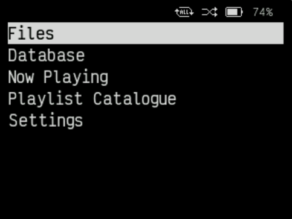
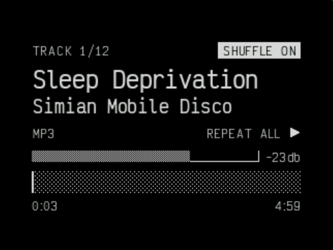

# SNAZZYBONES Rockbox theme

A simple, low-stimulus theme for the [Rockbox](https://en.wikipedia.org/wiki/Rockbox) targeting 320x240 screens. I use it on my iPod 5.5G.

It comes in two flavors:
- SNAZZYBONES-max (maximalist)
- SNAZZYBONES-min (minimalist)

## SNAZZYBONES-min (minimalist)

| SBS      | WPS      |
|------------|-------------|
|  |  | 

## SNAZZYBONES-max (maximalist)

Screenshots to come.

## Inspiration and Credit

SNAZZYBONES is based on two great themes:
- [SNAZZY](https://themes.rockbox.org/index.php?themeid=3627&target=cowond2) by Chris Graves
- [BONES](https://themes.rockbox.org/index.php?themeid=3579&target=cowond2) by Chuck Lardo

This theme's font is [Victor Mono](https://rubjo.github.io/victor-mono/), by Rune Bjørnerås.

See `LICENSES.md` for more information.

## Installation

1. [Install Rockbox](https://www.rockbox.org/download/)
1. Each theme has its own directory. Copy the `.rockbox` directory from the theme's directory to your music player's root directory.

# Misc

Taking screenshots from the Rockbox simulator:
1. Take a screenshot of the whole simulator window,
1. Run `magick input.png -crop 483x363+22+56 output.png`

# TODO

- [ ] Put screenshots in the README.
- [ ] Once the theme stabilizes, submit it to the Rockbox website.
- [ ] The smallest text in the theme is fuzzy. Find an alternative font to replace 15-VictorMono that looks sharper, doesn't require anti-aliasing at such a small size.

## WPS
- [ ] Show the artist name and album separately, rather than switching back and forth between them. Remove the file format from the WPS.
- [ ] Use more of the screen real estate, if it can be done without destroying its beauty. Using more of the screen will reduce title scrolling.

## SBS
- [ ] Reduce the size of the title, if doing so frees up space for something else.
- [ ] Remove "ROCKBOX" text at top left, move "LOCKED" text to top left. This will align it with the physical hold switch on the iPod 5.5G.
- [ ] Time and date: figure out how to have it stop switching between the two, and instead show either both or just the time. Perhaps put just the time at the top center.
- [ ] Experiment with using the BONES SBS font size. SNAZZY and BONES both show five list items at a time, which seems like the minimum usable number. The iPod 4G shows six, and the iPod 5G stock firmware shows nine.

## Quick Screen

- [ ] Add extra information about the current song to the Quick Screen, where the title used to be. Move the file format info from WPS to QS. Add bitrate, sample rate, etc. Is bit-depth necessary? Rockbox only supports 16-bit anyway.