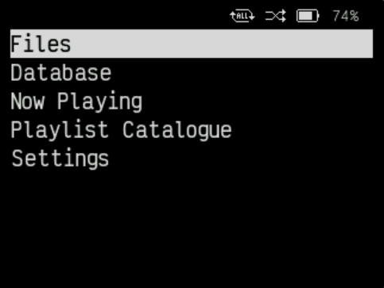
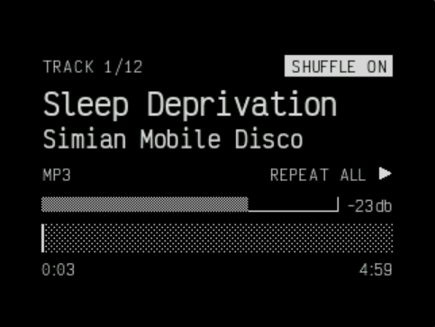

# SnazzyBones Rockbox theme

A simple, low-stimulus theme for the [Rockbox](https://en.wikipedia.org/wiki/Rockbox) targeting 320x240 screens. I use it on my iPod 5.5G.

It comes in three flavors:
- SnazzyBones-Max (maximalist)
- SnazzyBones (regular)
- SnazzyBones-Min (minimalist)

|  SnazzyBones-Max     | SnazzyBones-Min      |
|------------|-------------|
| Better for beginners to Rockbox | Better for people more experienced with Rockbox |
| More context | Less context   |
| More clutter | Less clutter  |
| Fewer list rows in the SBS |  More list rows in the SBS |

## Screenshots

### SnazzyBones-Min

| SBS      | WPS      |
|------------|-------------|
|  |  | 

# Inspiration and Credit

SnazzyBones is based on two great themes:
- [SNAZZY](https://themes.rockbox.org/index.php?themeid=3627&target=cowond2) by Chris Graves
- [BONES](https://themes.rockbox.org/index.php?themeid=3579&target=cowond2) by Chuck Lardo

This theme's font is [Victor Mono](https://rubjo.github.io/victor-mono/), by Rune Bjørnerås.

See `3P-LICENSES.md` for more information.

## Installation

1. [Install Rockbox](https://www.rockbox.org/download/)
1. Each theme has its own directory. Copy the `.rockbox` directory from the theme's directory to your music player's root directory.

# Misc

Taking screenshots from the Rockbox simulator:
1. Take a screenshot of the whole simulator window,
1. Run `magick input.png -crop 483x363+22+56 output.png`

