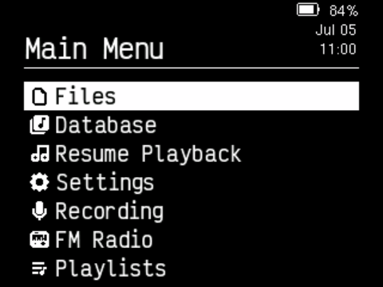
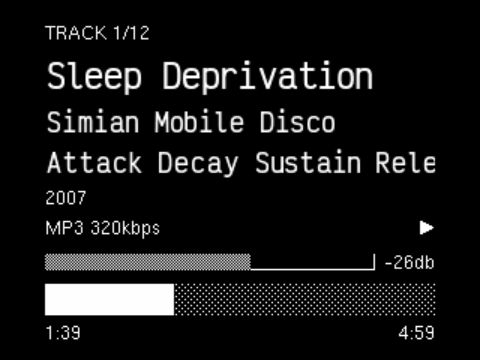

# SnazzyBones Rockbox theme

A simple, low-stimulus theme for the [Rockbox](https://en.wikipedia.org/wiki/Rockbox) targeting 320x240 screens. I use it on my iPod 5.5G.

## Screenshots

### SnazzyBones-Min

| SBS      | WPS      |
|------------|-------------|
|  |  | 

# Inspiration and Credit

SnazzyBones is based on two great themes:
- [SNAZZY](https://themes.rockbox.org/index.php?themeid=3627&target=cowond2) by Chris Graves
- [BONES](https://themes.rockbox.org/index.php?themeid=3579&target=cowond2) by Chuck Lardo

This theme's font is [Victor Mono](https://rubjo.github.io/victor-mono/), by Rune Bjørnerås.

See `3P-LICENSES.md` for more information.

## Installation

1. [Install Rockbox](https://www.rockbox.org/download/)
1. Copy the `SnazzyBones/.rockbox` to your music player's root directory.

# Misc

Taking screenshots from the Rockbox simulator:
1. Take a screenshot of the whole simulator window,
1. Run `magick input.png -crop 480x360+23+64 output.png`

